---

title: "SAW-C: Main Relatedness Analysis (with stimulus punctuation)"
author: "Sean Trott, Pam Riviere"
date: "October 9, 2024"
output:
  # pdf_document: 
  #    fig_caption: yes
  #    keep_md: yes
  #    keep_tex: yes
  html_document:
     keep_md: yes
     toc: yes
     toc_float: yes
     
---


# Load data


```r
setwd("/Users/seantrott/Dropbox/UCSD/Research/Ambiguity/SSD/spanish_norms/src/analysis/")
# setwd("/Users/pamelariviere/Desktop/projects/project_sawc/spanish_norms/src/analysis/")
# setwd("/Users/pamelariviere/Desktop/backburner_projects/projects_sean/sawc/spanish_norms/src/analysis/")
### Read in all data
df_final = read_csv("../../data/processed/human/sawc_relatedness_full_critical_data.csv")
nrow(df_final)
```

```
## [1] 10639
```

```r
length(unique(df_final$Participant))
```

```
## [1] 131
```

# RQ1: Same vs. Different Sense


```r
df_ratio = df_final %>% 
  group_by(Same_sense) %>%
  mutate(count_condition = n()) %>%
  ungroup() %>%
  group_by(Same_sense, Response, count_condition) %>%
  summarise(count_response = n()) %>%
  mutate(prop_response = count_response / count_condition)
              
df_ratio %>%         
  ggplot(aes(x = Response,
             y = prop_response)) +
  geom_bar(alpha = .6, stat = "identity") +
  theme_minimal() +
  labs(x = "Relatedness",
       y = "P(Response | Condition)") +
  facet_wrap(~Same_sense) +
  theme(text = element_text(size = 15),
        legend.position="none")
```

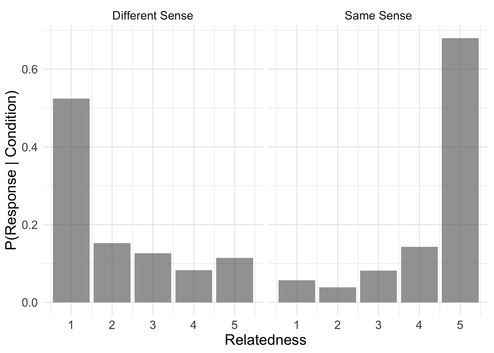<!-- -->

```r
df_final %>%         
  ggplot(aes(x = Response)) +
  geom_bar(alpha = .6, stat = "count") +
  theme_minimal() +
  labs(x = "Relatedness",
       y = "Count") +
  facet_wrap(~Same_sense) +
  theme(text = element_text(size = 15),
        legend.position="none")
```

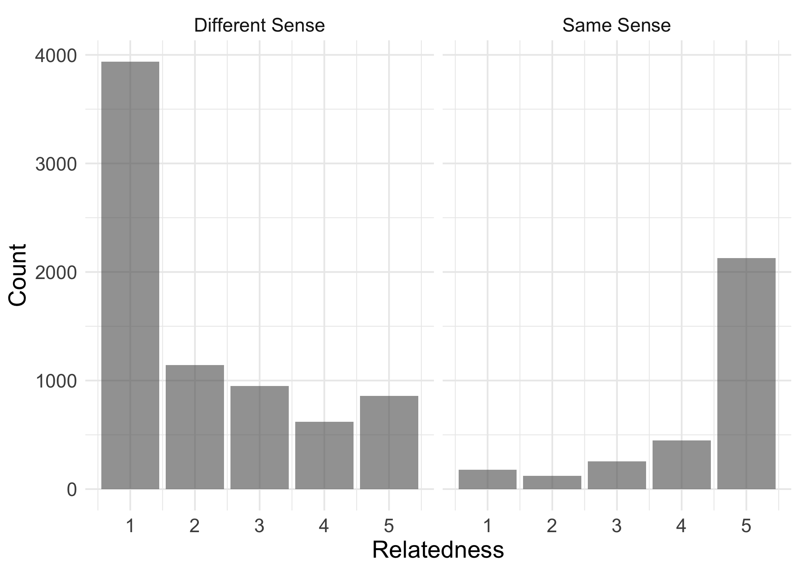<!-- -->

```r
df_final %>%
  group_by(Same_sense) %>%
  summarise(m_rel = mean(Response),
            sd_rel = sd(Response))
```

```
## # A tibble: 2 × 3
##   Same_sense      m_rel sd_rel
##   <chr>           <dbl>  <dbl>
## 1 Different Sense  2.11   1.41
## 2 Same Sense       4.35   1.14
```

```r
mod_full = lmer(data = df_final,
                Response ~ Same_sense +
                  (1 + Same_sense | Participant) + 
                  (1 + Same_sense | List) + (1 | Word),
                REML = FALSE)

mod_reduced = lmer(data = df_final,
                Response ~ # Same_sense +
                  (1 + Same_sense | Participant) + 
                  (1 + Same_sense | List) + (1 | Word),
                REML = FALSE)

summary(mod_full)
```

```
## Linear mixed model fit by maximum likelihood . t-tests use Satterthwaite's
##   method [lmerModLmerTest]
## Formula: Response ~ Same_sense + (1 + Same_sense | Participant) + (1 +  
##     Same_sense | List) + (1 | Word)
##    Data: df_final
## 
##      AIC      BIC   logLik deviance df.resid 
##  34198.6  34271.3 -17089.3  34178.6    10629 
## 
## Scaled residuals: 
##     Min      1Q  Median      3Q     Max 
## -3.8340 -0.6554 -0.1521  0.6411  3.2534 
## 
## Random effects:
##  Groups      Name                 Variance Std.Dev. Corr 
##  Participant (Intercept)          0.13240  0.3639        
##              Same_senseSame Sense 0.13065  0.3614   -0.59
##  Word        (Intercept)          0.32042  0.5661        
##  List        (Intercept)          0.02791  0.1671        
##              Same_senseSame Sense 0.07990  0.2827   -0.55
##  Residual                         1.35993  1.1662        
## Number of obs: 10639, groups:  Participant, 131; Word, 102; List, 10
## 
## Fixed effects:
##                      Estimate Std. Error       df t value Pr(>|t|)    
## (Intercept)           2.11454    0.08478 29.45271   24.94  < 2e-16 ***
## Same_senseSame Sense  2.24722    0.09838  9.67540   22.84 9.65e-10 ***
## ---
## Signif. codes:  0 '***' 0.001 '**' 0.01 '*' 0.05 '.' 0.1 ' ' 1
## 
## Correlation of Fixed Effects:
##             (Intr)
## Sm_snsSmSns -0.406
```

```r
anova(mod_full, mod_reduced)
```

```
## Data: df_final
## Models:
## mod_reduced: Response ~ (1 + Same_sense | Participant) + (1 + Same_sense | List) + (1 | Word)
## mod_full: Response ~ Same_sense + (1 + Same_sense | Participant) + (1 + Same_sense | List) + (1 | Word)
##             npar   AIC   BIC logLik deviance  Chisq Df Pr(>Chisq)    
## mod_reduced    9 34236 34302 -17109    34218                         
## mod_full      10 34199 34271 -17089    34179 39.589  1  3.135e-10 ***
## ---
## Signif. codes:  0 '***' 0.001 '**' 0.01 '*' 0.05 '.' 0.1 ' ' 1
```

# RQ2 + RQ5: Correlation with BETO

## Load and process BETO data


```r
### Define function to add a period to stimulus sentences
# Function to add a period if it's missing - credit: Claude
add_period <- function(sentence) {
  if (!grepl("[.!?]$", sentence)) {
    return(paste0(sentence, "."))
  }
  return(sentence)
}

### BETO distances
df_beto_distances = read_csv("../../data/processed/models_stimpunct/sawc-distances_model-bert-base-spanish-wwm-cased.csv")
nrow(df_beto_distances)
```

```
## [1] 10556
```

```r
### basic items to get Tag
df_sawc_items = read_csv("../../data/raw/items/sawc_sentence_pairs.csv")
df_sawc_items$Sentence_1 <- sapply(df_sawc_items$Sentence_1, add_period)
df_sawc_items$Sentence_2 <- sapply(df_sawc_items$Sentence_2, add_period)

### merge together
df_merged = df_beto_distances %>%
  left_join(df_sawc_items)
nrow(df_merged)
```

```
## [1] 10556
```

## Merge with SAW-C Norms


```r
### add periods to sentences in df_final
df_final$Sentence_1 <- sapply(df_final$Sentence_1, add_period)
df_final$Sentence_2 <- sapply(df_final$Sentence_2, add_period)

df_list_mean = df_final %>%
  group_by(List, Word, Tag) %>%
  summarise(mean_relatedness = mean(Response), .groups = "drop",
            count = n())
nrow(df_list_mean)
```

```
## [1] 812
```

```r
df_merged_beto = df_merged %>%
  inner_join(df_list_mean)
nrow(df_merged_beto)
```

```
## [1] 10556
```

## RQ2: Correlation by layer


```r
df_by_layer = df_merged_beto %>%
  group_by(Layer) %>%
  summarise(r = cor(mean_relatedness, Distance, method = "pearson"),
            r2 = r ** 2,
            rho = cor(mean_relatedness, Distance, method = "spearman"),
            count = n())

summary(df_by_layer$rho)
```

```
##     Min.  1st Qu.   Median     Mean  3rd Qu.     Max. 
## -0.61156 -0.59893 -0.58927 -0.49727 -0.45873  0.02152
```

```r
summary(df_by_layer$r2)
```

```
##     Min.  1st Qu.   Median     Mean  3rd Qu.     Max. 
## 0.000542 0.211907 0.330926 0.267934 0.341234 0.356878
```

```r
summary(df_by_layer$r)
```

```
##     Min.  1st Qu.   Median     Mean  3rd Qu.     Max. 
## -0.59739 -0.58415 -0.57526 -0.48882 -0.46033  0.02328
```

```r
df_by_layer %>%
  ggplot(aes(x = Layer,
             y = r)) +
  geom_line(size = 2,
            color = "cornflower blue") +
  theme_minimal() +
  labs(x = "Layer (BETO)",
       y = "Pearson's r") +
  scale_x_continuous(breaks = c(0:13)) +
  theme(text = element_text(size = 15),
        legend.position="none")
```

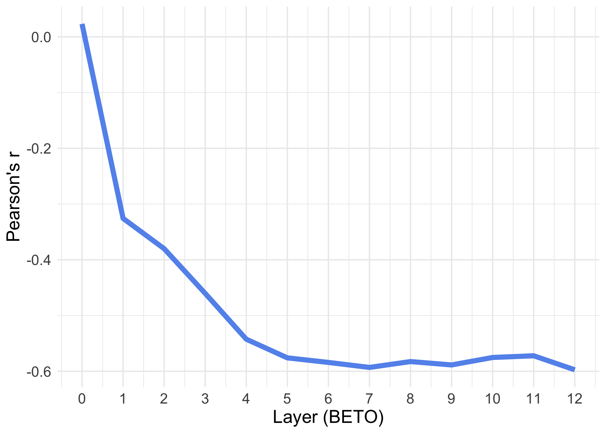<!-- -->

```r
df_by_layer %>%
  ggplot(aes(x = Layer,
             y = rho)) +
  geom_line(size = 2,
            color = "cornflower blue") +
  theme_minimal() +
  labs(x = "Layer (BETO)",
       y = "Spearman's rho") +
  scale_x_continuous(breaks = c(0:13)) +
  theme(text = element_text(size = 15),
        legend.position="none")
```

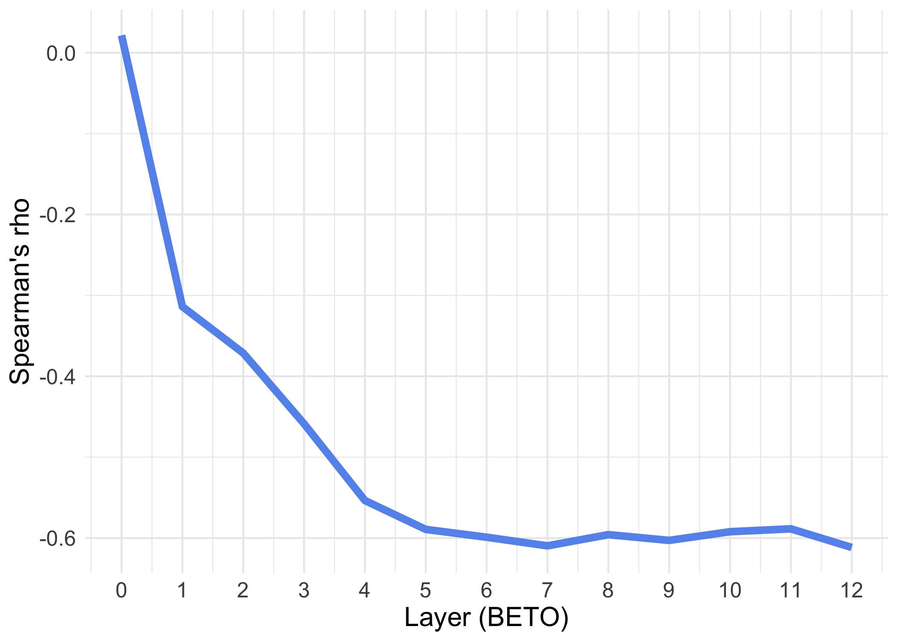<!-- -->

```r
df_by_layer %>%
  ggplot(aes(x = Layer,
             y = r2)) +
  geom_line(size = 2,
            color = "cornflower blue") +
  theme_minimal() +
  labs(x = "Layer (BETO)",
       y = "R2") +
  scale_x_continuous(breaks = c(0:13)) +
  theme(text = element_text(size = 15),
        legend.position="none")
```

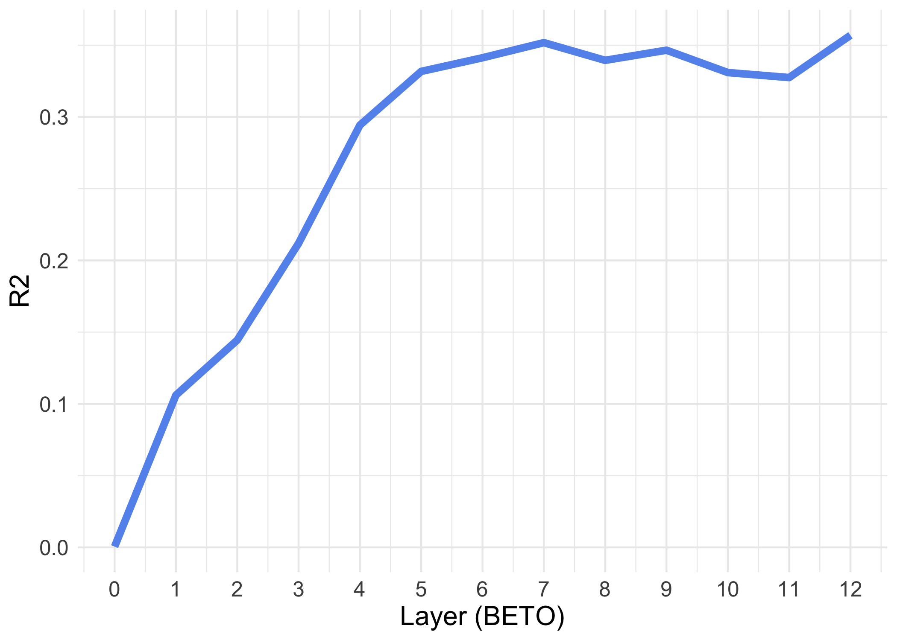<!-- -->

```r
min(df_by_layer$rho)
```

```
## [1] -0.6115575
```

## RQ5: Expected layer


```r
df_wide <- df_merged_beto %>%
  pivot_wider(
    names_from = Layer,       # This specifies where to get the names of the new columns
    values_from = Distance    # This specifies what values to fill the new columns with
  ) %>%
rename_with(.cols = matches("^[0-9]+$"),  
              .fn = ~ paste0("Layer", as.integer(.) + 1))  


base_formula <- "mean_relatedness ~ "

# Create a vector to hold all layer names that you want to include in the models
layer_names <- colnames(df_wide)[grepl("Layer", colnames(df_wide))]

# Generate the model formulas incrementally
formulas <- sapply(seq_along(layer_names), function(i) {
  paste(base_formula, paste(layer_names[1:i], collapse = " + "))
})

# Initialize a vector to store R-squared values
r_squared <- numeric(length(formulas))

# Loop over the formulas
for (i in seq_along(formulas)) {
  model <- lm(formulas[i], data = df_wide)
  r_squared[i] <- summary(model)$r.squared
}


df_results_expected = data.frame(r_squared, layer_names) %>%
  mutate(r2 = r_squared) %>%
  mutate(r2_delta = c(NA, diff(r2))) %>%
  mutate(Layer = as.numeric(gsub("Layer", "", layer_names)) - 1) %>%
  mutate(weighted_layer = Layer * r2_delta)

expected_layer = sum(df_results_expected$weighted_layer, na.rm = TRUE) / sum(df_results_expected$r2_delta, na.rm = TRUE)
expected_layer
```

```
## [1] 3.416069
```

# RQ3: Cosine distance vs. Same/Different

Now, we select the *best-performing layer* from BETO.


```r
df_beto_l5 = df_merged %>%
  filter(Layer == 7) %>%
  select(-Same_sense)
nrow(df_beto_l5)
```

```
## [1] 812
```

```r
df_experimental_with_beto = df_final %>%
  left_join(df_beto_l5)
nrow(df_experimental_with_beto)
```

```
## [1] 10639
```

```r
mod_full = lmer(data = df_experimental_with_beto,
                Response ~ Same_sense + Distance +
                  (1 + Same_sense + Distance | Participant) + 
                  (1 | List) + (1 | Word),
                REML = FALSE)

mod_reduced = lmer(data = df_experimental_with_beto,
                Response ~ Distance + # Same_sense +
                  (1 + Same_sense + Distance | Participant) + 
                  (1 | List) + (1 | Word),
                REML = FALSE)

mod_just_same = lmer(data = df_experimental_with_beto,
                Response ~ Same_sense + # Distance
                  (1 + Same_sense + Distance | Participant) + 
                  (1 | List) + (1 | Word),
                REML = FALSE)

summary(mod_full)
```

```
## Linear mixed model fit by maximum likelihood . t-tests use Satterthwaite's
##   method [lmerModLmerTest]
## Formula: Response ~ Same_sense + Distance + (1 + Same_sense + Distance |  
##     Participant) + (1 | List) + (1 | Word)
##    Data: df_experimental_with_beto
## 
##      AIC      BIC   logLik deviance df.resid 
##  33743.7  33831.0 -16859.9  33719.7    10627 
## 
## Scaled residuals: 
##     Min      1Q  Median      3Q     Max 
## -4.0322 -0.6348 -0.1078  0.6185  3.6093 
## 
## Random effects:
##  Groups      Name                 Variance Std.Dev. Corr       
##  Participant (Intercept)          0.25030  0.5003              
##              Same_senseSame Sense 0.19681  0.4436   -0.56      
##              Distance             0.78406  0.8855   -0.78  0.03
##  Word        (Intercept)          0.27246  0.5220              
##  List        (Intercept)          0.02121  0.1456              
##  Residual                         1.29819  1.1394              
## Number of obs: 10639, groups:  Participant, 131; Word, 102; List, 10
## 
## Fixed effects:
##                       Estimate Std. Error        df t value Pr(>|t|)    
## (Intercept)            2.97258    0.09216  69.43469   32.25   <2e-16 ***
## Same_senseSame Sense   1.83850    0.04972 146.72258   36.98   <2e-16 ***
## Distance              -4.38980    0.21735 321.73994  -20.20   <2e-16 ***
## ---
## Signif. codes:  0 '***' 0.001 '**' 0.01 '*' 0.05 '.' 0.1 ' ' 1
## 
## Correlation of Fixed Effects:
##             (Intr) Sm_sSS
## Sm_snsSmSns -0.410       
## Distance    -0.533  0.358
```

```r
anova(mod_full, mod_reduced)
```

```
## Data: df_experimental_with_beto
## Models:
## mod_reduced: Response ~ Distance + (1 + Same_sense + Distance | Participant) + (1 | List) + (1 | Word)
## mod_full: Response ~ Same_sense + Distance + (1 + Same_sense + Distance | Participant) + (1 | List) + (1 | Word)
##             npar   AIC   BIC logLik deviance  Chisq Df Pr(>Chisq)    
## mod_reduced   11 34067 34147 -17023    34045                         
## mod_full      12 33744 33831 -16860    33720 325.52  1  < 2.2e-16 ***
## ---
## Signif. codes:  0 '***' 0.001 '**' 0.01 '*' 0.05 '.' 0.1 ' ' 1
```

```r
anova(mod_full, mod_just_same)
```

```
## Data: df_experimental_with_beto
## Models:
## mod_just_same: Response ~ Same_sense + (1 + Same_sense + Distance | Participant) + (1 | List) + (1 | Word)
## mod_full: Response ~ Same_sense + Distance + (1 + Same_sense + Distance | Participant) + (1 | List) + (1 | Word)
##               npar   AIC   BIC logLik deviance  Chisq Df Pr(>Chisq)    
## mod_just_same   11 33964 34044 -16971    33942                         
## mod_full        12 33744 33831 -16860    33720 222.11  1  < 2.2e-16 ***
## ---
## Signif. codes:  0 '***' 0.001 '**' 0.01 '*' 0.05 '.' 0.1 ' ' 1
```

```r
### Visualize
df_experimental_with_beto %>%
  mutate(distance_binned = ntile(Distance, 20)) %>%
  group_by(Same_sense, distance_binned) %>%
  summarize(
    mean_relatedness = mean(Response),
    sd_relatedness = sd(Response),
    count = n(),
    se_relatedness = sd_relatedness / sqrt(count),
  ) %>%
  ggplot(aes(x = distance_binned, 
             y = mean_relatedness, 
             color = Same_sense, 
             fill = Same_sense)) +
  geom_line(size = 1.5) +
  geom_ribbon(aes(ymin = mean_relatedness - se_relatedness, 
                  ymax = mean_relatedness + se_relatedness), 
              alpha = 0.8,
              color = NA) +
  labs(x = "BETO Cosine Distance (Binned)",
       y = "Relatedness",
       color = "Same Sense",
       fill = "Same Sense") +
  theme_minimal() +
  scale_fill_manual(values = my_colors)  +
  scale_color_manual(values = my_colors)  +
  theme(text = element_text(size = 15),
        legend.position="bottom")
```

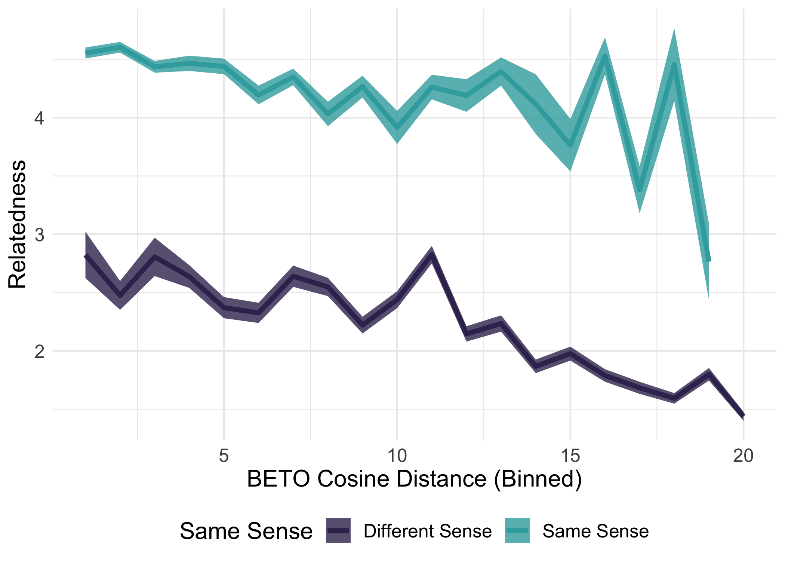<!-- -->

# RQ4: BETO vs. inter-annotator agreement


```r
### First, get group means
df_list_mean = df_experimental_with_beto %>%
  group_by(List, Word, Tag, Same_sense) %>%
  summarise(mean_relatedness = mean(Response), .groups = "drop",
            count = n(),
            distance = mean(Distance))
nrow(df_list_mean)
```

```
## [1] 812
```

```r
### Get BETO cor
BETO_COR = abs(cor(df_list_mean$mean_relatedness,
               df_list_mean$distance, method = "spearman"))

### Now, iterate through ppts
ppts = unique(df_final$Participant)
df_r = data.frame()

for (ppt in ppts) {
  # Subset df_critical for the current participant
  individual_data <- df_final %>%
    filter(Participant == ppt) %>%
    select(List, Word, Tag, Response)  # Ensure you're selecting the needed columns

  # Merge individual data with mean data
  merged_data <- inner_join(individual_data, df_list_mean, by = c("List", "Word", "Tag"))
  
  test = cor.test(merged_data$Response,
                  merged_data$mean_relatedness,
                 method = "spearman")
  
  df_test = broom::tidy(test)
  df_test$ppt = ppt
  df_test$List = unique(individual_data$List)
  df_r = rbind(df_r, df_test)

}

### Visualization
df_r %>%
  ggplot(aes(x = estimate)) +
  geom_histogram(alpha = .6) +
  scale_x_continuous(limits = c(0, 1)) +
  theme_minimal() +
  geom_vline(xintercept = BETO_COR, size = 1.5, 
             linetype = "dashed", alpha = .7) +
  labs(x = "Leave-one-out Correlation") +
  theme(text = element_text(size = 15),
        legend.position="none")
```

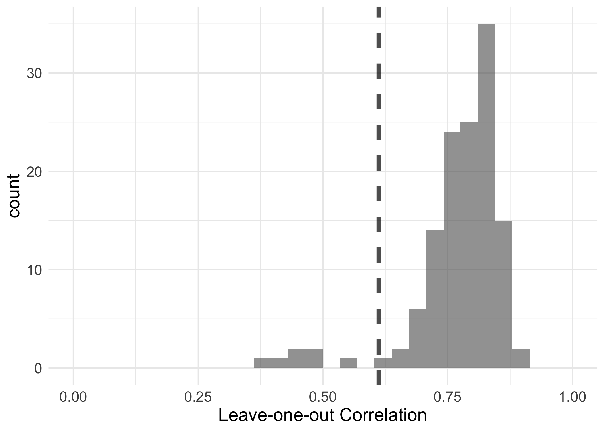<!-- -->

```r
summary(df_r$estimate)
```

```
##    Min. 1st Qu.  Median    Mean 3rd Qu.    Max. 
##  0.3946  0.7480  0.7962  0.7725  0.8308  0.8834
```

```r
### What proportion of inter-annotator agreement scores are larger?
prop_larger = df_r %>%
  mutate(larger = estimate >= BETO_COR) %>%
  summarise(mean(larger))
prop_larger
```

```
## # A tibble: 1 × 1
##   `mean(larger)`
##            <dbl>
## 1          0.947
```

## Calculate R2


```r
### Full model
summary(lm(data = df_list_mean,
           mean_relatedness ~ Same_sense + distance))
```

```
## 
## Call:
## lm(formula = mean_relatedness ~ Same_sense + distance, data = df_list_mean)
## 
## Residuals:
##     Min      1Q  Median      3Q     Max 
## -2.3689 -0.5274 -0.0524  0.4403  2.5100 
## 
## Coefficients:
##                      Estimate Std. Error t value Pr(>|t|)    
## (Intercept)           2.94142    0.07765   37.88   <2e-16 ***
## Same_senseSame Sense  1.83679    0.06724   27.32   <2e-16 ***
## distance             -4.11245    0.35189  -11.69   <2e-16 ***
## ---
## Signif. codes:  0 '***' 0.001 '**' 0.01 '*' 0.05 '.' 0.1 ' ' 1
## 
## Residual standard error: 0.7602 on 809 degrees of freedom
## Multiple R-squared:  0.6628,	Adjusted R-squared:  0.6619 
## F-statistic:   795 on 2 and 809 DF,  p-value: < 2.2e-16
```

```r
### Just same sense
summary(lm(data = df_list_mean,
           mean_relatedness ~ Same_sense))
```

```
## 
## Call:
## lm(formula = mean_relatedness ~ Same_sense, data = df_list_mean)
## 
## Residuals:
##     Min      1Q  Median      3Q     Max 
## -2.2490 -0.6487 -0.1114  0.4836  2.6364 
## 
## Coefficients:
##                      Estimate Std. Error t value Pr(>|t|)    
## (Intercept)           2.11357    0.03437   61.49   <2e-16 ***
## Same_senseSame Sense  2.22638    0.06310   35.28   <2e-16 ***
## ---
## Signif. codes:  0 '***' 0.001 '**' 0.01 '*' 0.05 '.' 0.1 ' ' 1
## 
## Residual standard error: 0.8214 on 810 degrees of freedom
## Multiple R-squared:  0.6058,	Adjusted R-squared:  0.6054 
## F-statistic:  1245 on 1 and 810 DF,  p-value: < 2.2e-16
```

```r
### Just cosine distance
summary(lm(data = df_list_mean,
           mean_relatedness ~ distance))
```

```
## 
## Call:
## lm(formula = mean_relatedness ~ distance, data = df_list_mean)
## 
## Residuals:
##      Min       1Q   Median       3Q      Max 
## -2.99262 -0.78540  0.01506  0.86980  2.60768 
## 
## Coefficients:
##             Estimate Std. Error t value Pr(>|t|)    
## (Intercept)  4.31185    0.08213   52.50   <2e-16 ***
## distance    -8.87766    0.42344  -20.96   <2e-16 ***
## ---
## Signif. codes:  0 '***' 0.001 '**' 0.01 '*' 0.05 '.' 0.1 ' ' 1
## 
## Residual standard error: 1.053 on 810 degrees of freedom
## Multiple R-squared:  0.3518,	Adjusted R-squared:  0.351 
## F-statistic: 439.5 on 1 and 810 DF,  p-value: < 2.2e-16
```

# RQ6: Layer vs. same/different


```r
# Calculate mean and SE of Distance
df_summary <- df_beto_distances %>%
  group_by(Layer, Same_sense) %>%
  summarise(
    mean_Distance = mean(Distance),
    sd_Distance = sd(Distance),
    count = n(),
    se_Distance = sd_Distance / sqrt(count),
    .groups = 'drop'  # Drop the automatic grouping by dplyr
  )

# Modify Same_sense
df_summary = df_summary %>%
  mutate(Same_sense = case_when(
    Same_sense == TRUE ~ "Same Sense",
    Same_sense == FALSE ~ "Different Sense"
  ))
  

df_summary %>%
  ggplot(aes(x = Layer, 
             y = mean_Distance, 
             color = Same_sense, 
             fill = Same_sense)) +
  geom_line(size = 1.5) +
  geom_ribbon(aes(ymin = mean_Distance - 2 * se_Distance, 
                  ymax = mean_Distance + 2 * se_Distance), 
              alpha = 0.8,
              color = NA) +
  labs(x = "Layer (BETO)",
       y = "Mean Distance",
       color = "",
       fill = "") +
  scale_x_continuous(breaks = c(0:13)) +
  theme_minimal() +
  # scale_fill_viridis(option = "mako", discrete=TRUE) +
  # scale_color_viridis(option = "mako", discrete=TRUE) +
  scale_fill_manual(values = my_colors)  +
  scale_color_manual(values = my_colors)  +
  theme(text = element_text(size = 15),
        legend.position="bottom")
```

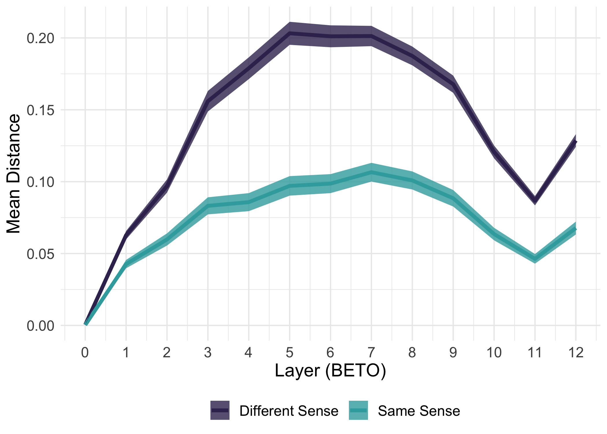<!-- -->

```r
### Centered by layer
df_summary %>%
  group_by(Layer) %>%
  mutate(Distance_scaled = mean_Distance - mean(mean_Distance)) %>%
  ggplot(aes(x = Layer, 
             y = Distance_scaled, 
             color = Same_sense, 
             fill = Same_sense)) +
  geom_line(size = 1.5) +
  geom_ribbon(aes(ymin = Distance_scaled - 2 * se_Distance, 
                  ymax = Distance_scaled + 2 * se_Distance), 
              alpha = 0.8,
              color = NA) +
  labs(x = "Layer (BETO)",
       y = "Mean Distance (Centered)",
       color = "Same Sense",
       fill = "Same Sense") +
  scale_x_continuous(breaks = c(0:13)) +
  theme_minimal() +
  # scale_fill_viridis(option = "mako", discrete=TRUE) +
  # scale_color_viridis(option = "mako", discrete=TRUE) +
  scale_fill_manual(values = my_colors)  +
  scale_color_manual(values = my_colors)  +
  theme(text = element_text(size = 15),
        legend.position="bottom")
```

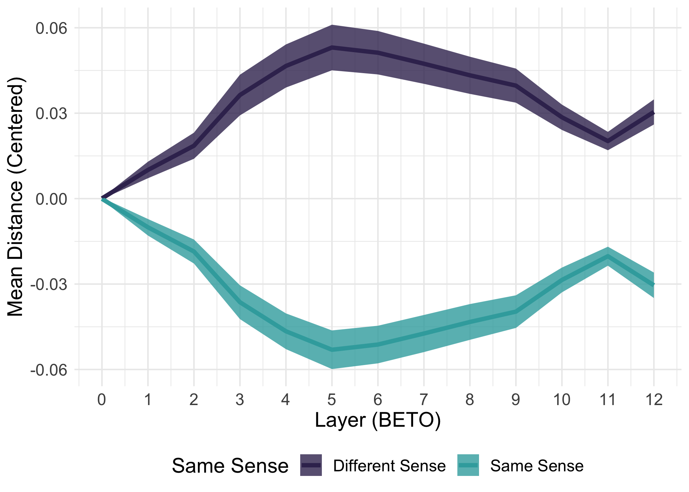<!-- -->

We also build a logistic regression model for each layer.


```r
df_wide <- df_beto_distances %>%
  pivot_wider(
    names_from = Layer,       # This specifies where to get the names of the new columns
    values_from = Distance    # This specifies what values to fill the new columns with
  ) %>%
rename_with(.cols = matches("^[0-9]+$"),  
              .fn = ~ paste0("Layer", as.integer(.) + 1))  


base_formula <- "Same_sense ~ "

# Create a vector to hold all layer names that you want to include in the models
layer_names <- colnames(df_wide)[grepl("Layer", colnames(df_wide))]

# Generate the model formulas incrementally: individual
formulas_individual <- sapply(seq_along(layer_names), function(i) {
  paste(base_formula, paste(layer_names[i], collapse = " + "))
})

# Generate the model formulas incrementally: altogether
formulas_combined <- sapply(seq_along(layer_names), function(i) {
  paste(base_formula, paste(layer_names[1:i], collapse = " + "))
})


aic_individual <- numeric(length(formulas_individual))
aic_together <- numeric(length(formulas_combined))


# Loop over the formulas
for (i in seq_along(formulas_combined)) {
  model <- glm(formulas_combined[i], data = df_wide, family = binomial())
  aic_together[i] <- summary(model)$aic
}

# Loop over the formulas
for (i in seq_along(formulas_individual)) {
  model <- glm(formulas_individual[i], data = df_wide, family = binomial())
  aic_individual[i] <- summary(model)$aic
}

# 
df_results_expected = data.frame(aic_individual, aic_together, layer_names) %>%
  mutate(aic_delta = -c(NA, diff(aic_together))) %>%
  mutate(Layer = as.numeric(gsub("Layer", "", layer_names)) - 1) %>%
  mutate(weighted_layer = Layer * aic_delta)

expected_layer = sum(df_results_expected$weighted_layer, na.rm = TRUE) / sum(df_results_expected$aic_delta, na.rm = TRUE)
expected_layer
```

```
## [1] 3.601853
```

```r
df_results_expected %>%
  filter(aic_individual == min(df_results_expected$aic_individual))
```

```
##   aic_individual aic_together layer_names aic_delta Layer weighted_layer
## 1        712.906     699.0237      Layer7 -1.090169     6      -6.541017
```

# Additional visualizations


```r
df_item_means = df_final %>%
  group_by(List, Word, Same_sense, Sentence_1, Sentence_2,
           Sense_id_s1, Sense_id_s2, Gender_s1, Gender_s2) %>%
  summarise(mean_relatedness = mean(Response),
            sd_relatedness = sd(Response),
            median_relatedness = median(Response),
            count = n())


df_item_means %>%         
  ggplot(aes(x = mean_relatedness)) +
  geom_histogram(alpha = .6, bins = 10) +
  theme_minimal() +
  labs(x = "Mean Relatedness",
       y = "Count") +
  facet_wrap(~Same_sense) +
  theme(text = element_text(size = 15),
        legend.position="none")
```

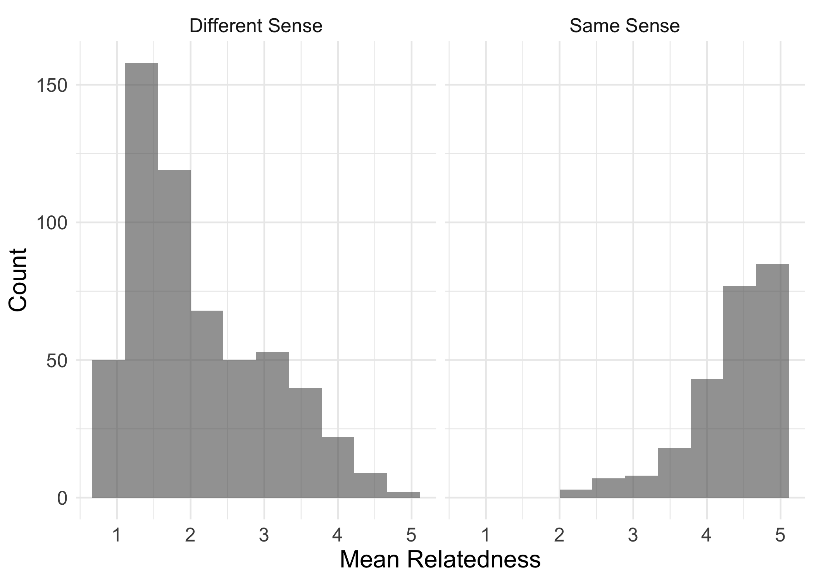<!-- -->

```r
df_item_means %>%
  ggplot(aes(x = mean_relatedness,
             y = Same_sense,
             fill = Same_sense)) +
  geom_density_ridges2(aes(height = ..density..), 
                       color=gray(0.25), 
                       alpha = .7, 
                       scale=.85, 
                       # size=1, 
                       size = 0,
                       stat="density") +
  labs(x = "Mean Relatedness",
       y = "",
       fill = "") +
  theme_minimal()+
  scale_fill_manual(values = my_colors)  +
  theme(text = element_text(size = 15),
        legend.position="none") 
```

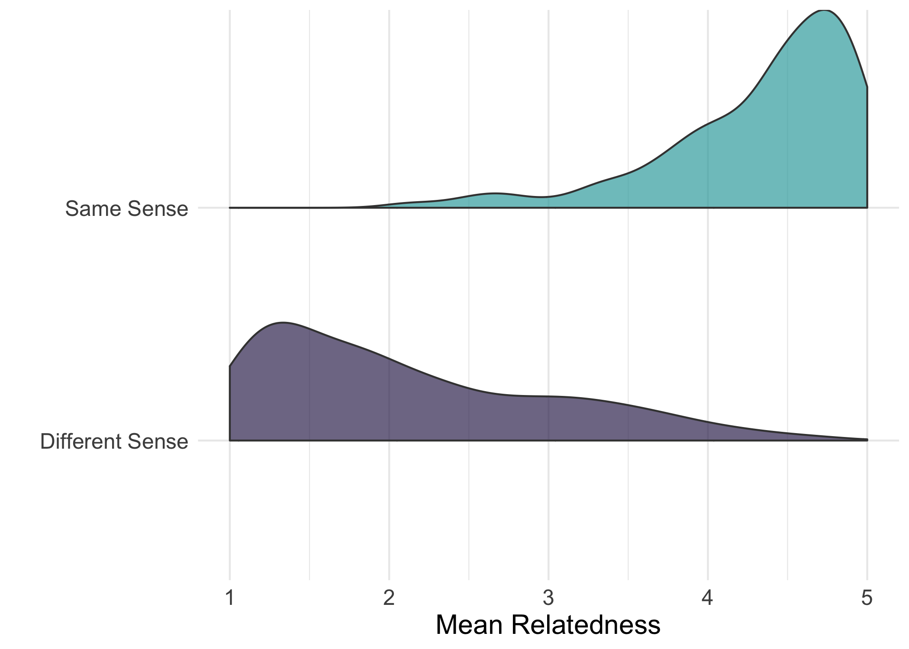<!-- -->

# Comparing all models together


```r
df_beto = read_csv("../../data/processed/models_stimpunct/sawc-distances_model-bert-base-spanish-wwm-cased.csv") %>%
  mutate(Model = "BETO-cased",
         Multilingual = "Monolingual")
df_xlm = read_csv("../../data/processed/models_stimpunct/sawc-distances_model-xlm-roberta-base.csv") %>%
  mutate(Model = "XLM-RoBERTa",
         Multilingual = "Multilingual")

df_mb = read_csv("../../data/processed/models_stimpunct/sawc-distances_model-bert-base-multilingual-cased.csv") %>%
  mutate(Model = "Multilingual BERT",
         Multilingual = "Multilingual")

df_db = read_csv("../../data/processed/models_stimpunct/sawc-distances_model-distilbert-base-spanish-uncased.csv") %>%
  mutate(Model = "DistilBETO",
         Multilingual = "Monolingual")

df_ab = read_csv("../../data/processed/models_stimpunct/sawc-distances_model-albert-base-spanish.csv") %>%
  mutate(Model = "ALBERT-base",
         Multilingual = "Monolingual")

df_at = read_csv("../../data/processed/models_stimpunct/sawc-distances_model-albert-tiny-spanish.csv") %>%
  mutate(Model = "ALBERT-tiny",
         Multilingual = "Monolingual")

df_axl = read_csv("../../data/processed/models_stimpunct/sawc-distances_model-albert-xlarge-spanish.csv") %>%
  mutate(Model = "ALBERT-xlarge",
         Multilingual = "Monolingual")

df_al = read_csv("../../data/processed/models_stimpunct/sawc-distances_model-albert-large-spanish.csv") %>%
  mutate(Model = "ALBERT-large",
         Multilingual = "Monolingual")

df_axxl = read_csv("../../data/processed/models_stimpunct/sawc-distances_model-albert-xxlarge-spanish.csv") %>%
  mutate(Model = "ALBERT-xxlarge",
         Multilingual = "Monolingual")

df_rb = read_csv("../../data/processed/models_stimpunct/sawc-distances_model-roberta-base-bne.csv") %>%
  mutate(Model = "RoBERTa-base",
         Multilingual = "Monolingual")

df_rl = read_csv("../../data/processed/models_stimpunct/sawc-distances_model-roberta-large-bne.csv") %>%
  mutate(Model = "RoBERTa-large",
         Multilingual = "Monolingual")

df_beto_uncased = read_csv("../../data/processed/models_stimpunct/sawc-distances_model-bert-base-spanish-wwm-uncased.csv") %>%
  mutate(Model = "BETO-uncased",
         Multilingual = "Monolingual")

df_all = df_beto %>%
  bind_rows(df_xlm) %>%
  bind_rows(df_db) %>%
  bind_rows(df_ab) %>%
  bind_rows(df_at) %>%
  bind_rows(df_mb) %>%
  bind_rows(df_axl) %>%
  bind_rows(df_al) %>%
  bind_rows(df_axxl) %>%
  bind_rows(df_rb) %>%
  bind_rows(df_rl) %>%
  bind_rows(df_beto_uncased)

nrow(df_all)
```

```
## [1] 144536
```

```r
### merge together
df_merged = df_all %>%
  left_join(df_sawc_items)

df_list_mean = df_final %>%
  group_by(List, Word, Tag) %>%
  summarise(mean_relatedness = mean(Response), .groups = "drop",
            count = n())
nrow(df_list_mean)
```

```
## [1] 812
```

```r
df_merged = df_merged %>%
  inner_join(df_list_mean)
nrow(df_merged)
```

```
## [1] 144536
```

## Distance by layer, by model


```r
df_distance_by_layer = df_merged %>%
  group_by(Model, Multilingual, Same_sense, Layer, n_params) %>%
  summarise(mean_distance = mean(Distance),
            .groups = 'drop'  # Drop the automatic grouping by dplyr
  )

nrow(df_distance_by_layer)
```

```
## [1] 356
```

```r
df_distance_by_layer_wide = df_distance_by_layer %>%
  pivot_wider(names_from = "Same_sense",
              values_from = "mean_distance",
              names_prefix = "Distance_") %>%
  mutate(Diff = Distance_FALSE - Distance_TRUE)


df_families = data.frame(
  Model = unique(df_distance_by_layer_wide$Model),
  Family = c("ALBERT", "ALBERT", "ALBERT", "ALBERT",
             "ALBERT", "BERT", "BERT", "BERT", "BERT",
             "RoBERTa", "RoBERTa", "RoBERTa")
)

df_distance_by_layer_wide = df_distance_by_layer_wide %>%
  group_by(Model) %>%
  mutate(max_layer = max(Layer),
         prop_layer = Layer / max_layer)  %>%
  inner_join(df_families)


df_distance_by_layer_wide %>%
  ggplot(aes(x = prop_layer,
             y = Diff)) +
  geom_line(size = .5, aes(color = Model, group = Model),
            alpha = .3) + 
  stat_summary(
    fun = mean,                    # calculate mean
    geom = "line",                 # use line geometry
    size = 2,                    # set line size
    na.rm = TRUE                   # remove NA values
  ) +
  theme_minimal() +
  labs(x = "Proportion of Total Layers",
       y = "Mean Difference (Different - Same Sense)",
       color = "") +  # Renaming legend title appropriately
  scale_color_viridis(option = "mako", discrete = TRUE) +
  theme(text = element_text(size = 15),
        legend.position = "none") 
```

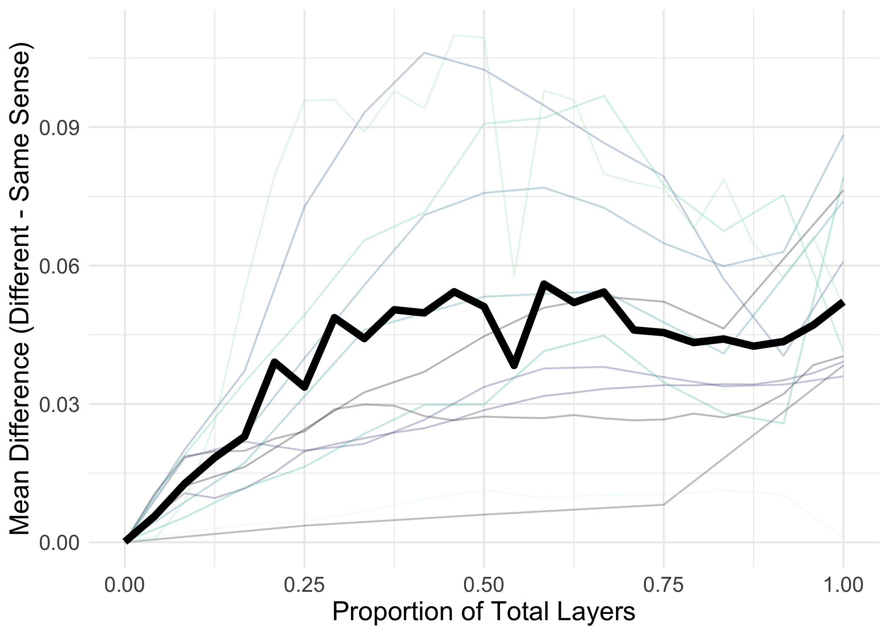<!-- -->

```r
df_distance_by_layer_wide %>%
  mutate(binned_prop_layer = ntile(prop_layer, 10)) %>%
  mutate(prop_binned = binned_prop_layer / 10) %>%
  ggplot(aes(x = prop_binned,
             y = Diff)) +
  stat_summary(
    aes(group = Family,
        color = Family),  
    fun = mean,    
    geom = "line",        
    size = 2              
  ) +
  stat_summary(
    aes(group = Family, 
        fill = Family), 
    fun.data = mean_se,    
    geom = "ribbon",  
    alpha = 0.2,   
    color = NA     
  ) +
  theme_minimal() +
  labs(x = "Layer Depth Ratio",
       y = "Mean Cosine Distance Difference (Different - Same Sense)",
       color = "Family") +
  scale_color_viridis(option = "mako", discrete = TRUE) +
  theme(text = element_text(size = 15),
        legend.position = "bottom") 
```

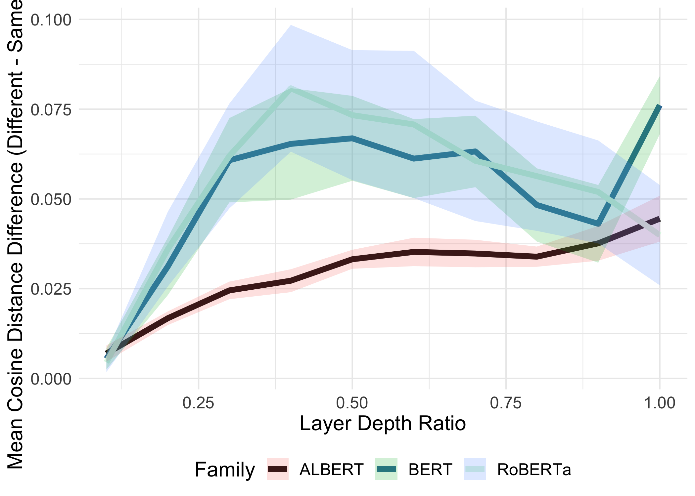<!-- -->

## R2 by layer, by model


```r
df_by_layer = df_merged %>%
  group_by(Model, Multilingual, Layer, n_params) %>%
  summarise(r = cor(mean_relatedness, Distance, method = "pearson"),
            r2 = r ** 2,
            rho = cor(mean_relatedness, Distance, method = "spearman"),
            count = n())

max(df_by_layer$r2)
```

```
## [1] 0.3912443
```

```r
df_by_layer %>%
  filter(r2 == max(df_by_layer$r2))
```

```
## # A tibble: 1 × 8
## # Groups:   Model, Multilingual, Layer [1]
##   Model         Multilingual Layer  n_params      r    r2    rho count
##   <chr>         <chr>        <dbl>     <dbl>  <dbl> <dbl>  <dbl> <int>
## 1 RoBERTa-large Monolingual     23 355356672 -0.625 0.391 -0.657   812
```

```r
df_by_layer %>%
  filter(Model != "ALBERT-tiny") %>%
  filter(Model != "ALBERT-xlarge") %>%
  filter(Model != "DistilBETO") %>%
  filter(Model != "ALBERT-large") %>%
  filter(Model != "RoBERTa-large") %>%
  ggplot(aes(x = Layer,
             y = r2,
             color = Model,
             linetype = Model)) +
  geom_line(size = 2) +
  theme_minimal() +
  labs(x = "Layer",
       y = "R2",
       color = "",
       linetype = "") +
  scale_x_continuous(breaks = c(0:13)) +
  scale_color_viridis(option = "mako", discrete=TRUE) +
  theme(text = element_text(size = 12),
        legend.position="bottom")
```

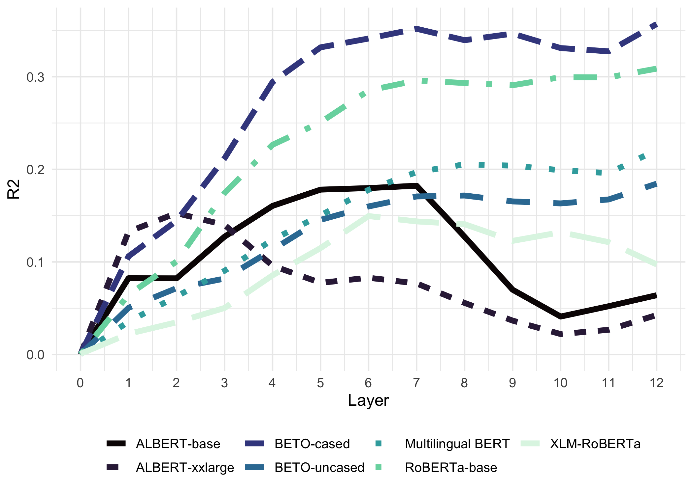<!-- -->

```r
df_by_layer %>%
  filter(Model != "ALBERT-tiny") %>%
  filter(Model != "ALBERT-xlarge") %>%
  filter(Model != "DistilBETO") %>%
  filter(Model != "ALBERT-large") %>%
  filter(Model != "RoBERTa-large") %>%
  ggplot(aes(x = Layer,
             y = r2,
             color = Model)) +
  geom_line(size = 2) +
  theme_minimal() +
  labs(x = "Layer",
       y = "R2",
       color = "") +
  scale_x_continuous(breaks = c(0:13)) +
  scale_color_viridis(option = "mako", discrete=TRUE) +
  theme(text = element_text(size = 12),
        legend.position="bottom")
```

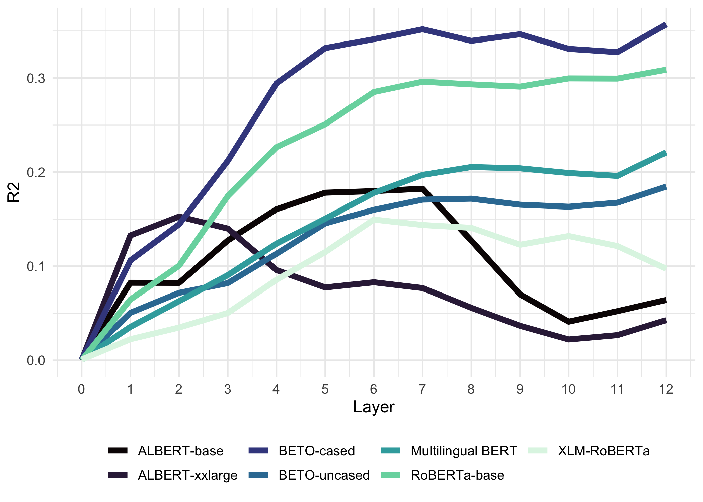<!-- -->

```r
df_by_layer %>%
  filter(Model %in% c("ALBERT-xlarge", 
                      "ALBERT-large",
                      "RoBERTa-large")) %>%
  ggplot(aes(x = Layer,
             y = r2,
             color = Model)) +
  geom_line(size = 2) +
  theme_minimal() +
  labs(x = "Layer",
       y = "R2",
       color = "") +
  scale_color_viridis(option = "mako", discrete=TRUE) +
  theme(text = element_text(size = 15),
        legend.position="bottom")
```

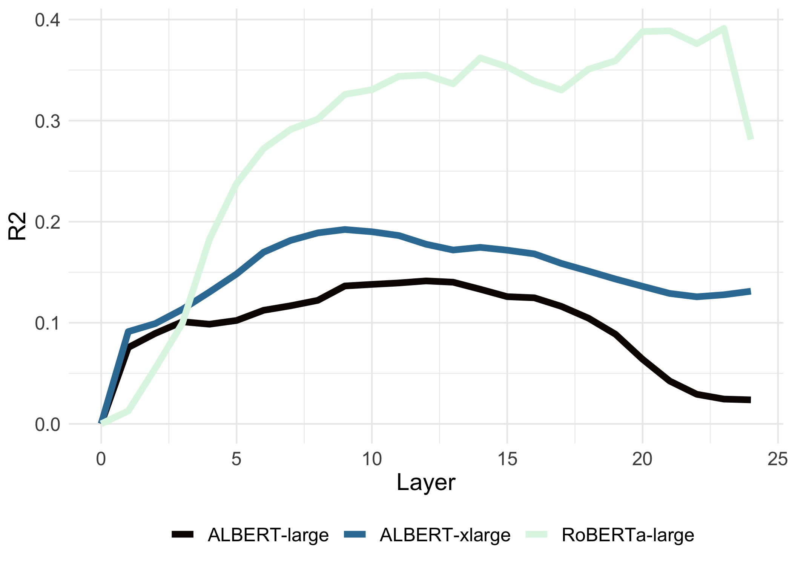<!-- -->

We can also break this down by looking at the *proportion of layers* through the model.


```r
df_families = data.frame(
  Model = unique(df_by_layer$Model),
  Family = c("ALBERT", "ALBERT", "ALBERT", "ALBERT",
             "ALBERT", "BERT", "BERT", "BERT", "BERT",
             "RoBERTa", "RoBERTa", "RoBERTa")
)

df_by_layer = df_by_layer %>%
  group_by(Model) %>%
  mutate(max_layer = max(Layer),
         prop_layer = Layer / max_layer)  %>%
  inner_join(df_families)


df_by_layer %>%
  ggplot(aes(x = prop_layer,
             y = r2)) +
  geom_line(size = .5, aes(color = Model, group = Model),
            alpha = .3) + 
  stat_summary(
    fun = mean,                    # calculate mean
    geom = "line",                 # use line geometry
    size = 2,                    # set line size
    na.rm = TRUE                   # remove NA values
  ) +
  theme_minimal() +
  labs(x = "Proportion of Total Layers",
       y = "R2",
       color = "") +  # Renaming legend title appropriately
  scale_color_viridis(option = "mako", discrete = TRUE) +
  theme(text = element_text(size = 15),
        legend.position = "none") 
```

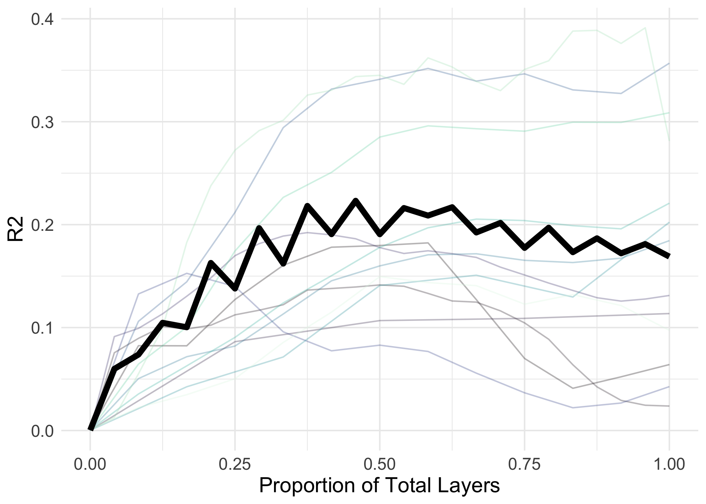<!-- -->

```r
df_by_layer %>%
  ggplot(aes(x = prop_layer,
             y = r2,
             color = Family)) + 
  geom_smooth(size = 2) +
  scale_color_viridis(option = "mako", discrete = TRUE) +
  theme_minimal() +
  labs(x = "Proportion of Total Layers",
       y = "R2",
       color = "Family") +
  theme(text = element_text(size = 15),
        legend.position = "bottom") 
```

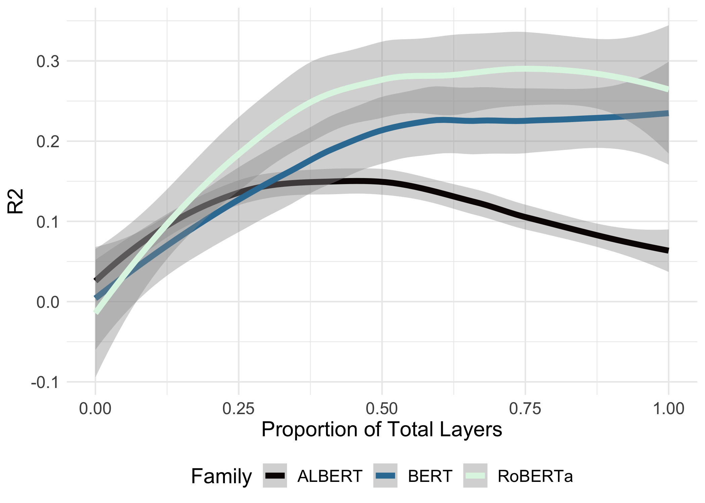<!-- -->

```r
df_by_layer %>%
  mutate(binned_prop_layer = ntile(prop_layer, 10)) %>%
  mutate(prop_binned = binned_prop_layer / 10) %>%
  ggplot(aes(x = prop_binned,
             y = r2)) +
  stat_summary(
    aes(group = Family,
        color = Family),  
    fun = mean,    
    geom = "line",        
    size = 2              
  ) +
  stat_summary(
    aes(group = Family, 
        fill = Family), 
    fun.data = mean_se,    
    geom = "ribbon",  
    alpha = 0.2,   
    color = NA     
  ) +
  theme_minimal() +
  labs(x = "Layer Depth Ratio",
       y = "R2",
       color = "Family") +
  scale_color_viridis(option = "mako", discrete = TRUE) +
  theme(text = element_text(size = 15),
        legend.position = "bottom") 
```

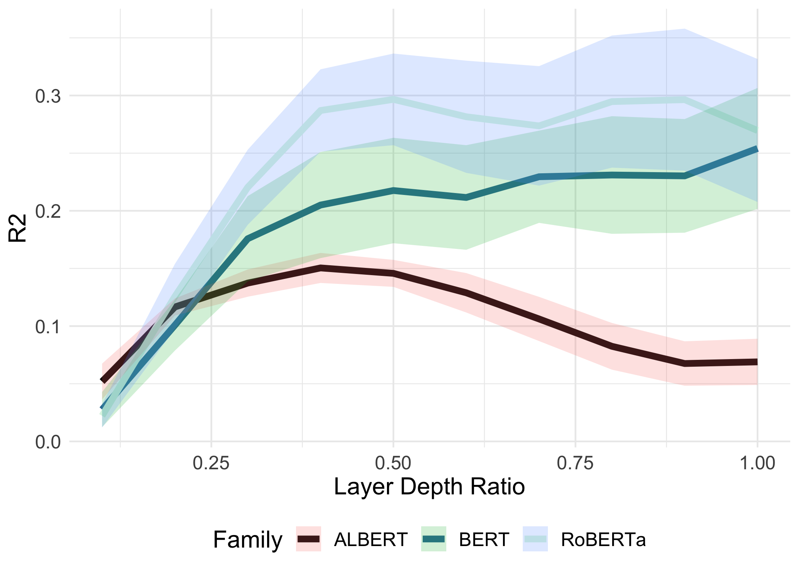<!-- -->

## Comparison by model parameters

The BETO/ALBERT/DistilBETO family of models provide a nice within-family comparison of the effect of number of **parameters**, since they are trained on the same datasets.


```r
df_max_r2 = df_by_layer %>%
  group_by(Model, n_params, Multilingual) %>%
  summarise(max_r2 = max(r2))

df_max_r2 %>%
  ggplot(aes(x = n_params,
             y = max_r2,
             color = Multilingual,
             shape = Multilingual)) +
  geom_point(size = 6,
             alpha = .7) +
  geom_hline(yintercept = mean(df_r$estimate)**2, ### Human accuracy 
              linetype = "dotted", color = "red",
             size = 1.2, alpha = .5) +
  geom_text_repel(aes(label=Model), size=3) +
  scale_x_log10() +
  scale_y_continuous(limits = c(0, 1)) +
  labs(x = "Parameters",
       y = "Maximum R2",
       color = "",
       shape = "") +
  theme_minimal() +
  # guides(color="none") +
  # scale_color_viridis(option = "mako", discrete=TRUE) +
  scale_color_manual(values = my_colors)  +
  theme(text = element_text(size = 15),
        legend.position="bottom")
```

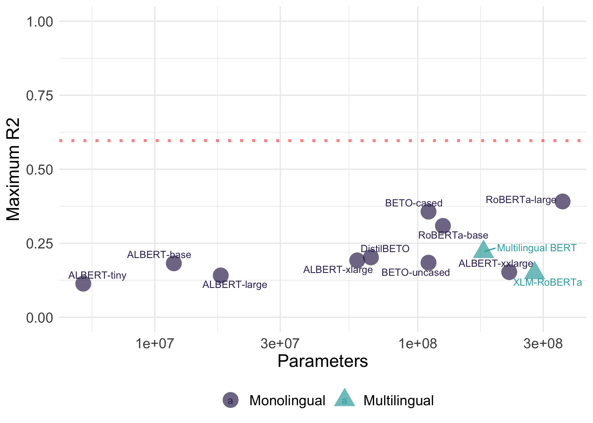<!-- -->

```r
summary(lm(data = df_max_r2,
           max_r2 ~ log10(n_params) + Multilingual))
```

```
## 
## Call:
## lm(formula = max_r2 ~ log10(n_params) + Multilingual, data = df_max_r2)
## 
## Residuals:
##      Min       1Q   Median       3Q      Max 
## -0.13036 -0.03405 -0.01244  0.04742  0.10604 
## 
## Coefficients:
##                          Estimate Std. Error t value Pr(>|t|)  
## (Intercept)              -0.59331    0.33355  -1.779   0.1090  
## log10(n_params)           0.10498    0.04281   2.452   0.0366 *
## MultilingualMultilingual -0.09780    0.06302  -1.552   0.1551  
## ---
## Signif. codes:  0 '***' 0.001 '**' 0.01 '*' 0.05 '.' 0.1 ' ' 1
## 
## Residual standard error: 0.07488 on 9 degrees of freedom
## Multiple R-squared:  0.4167,	Adjusted R-squared:  0.2871 
## F-statistic: 3.215 on 2 and 9 DF,  p-value: 0.0884
```

## `Same` vs. `Different` Sense residuals


```r
# Fit models and calculate residuals for each LLM
models <- by(df_merged, df_merged$Model, function(subdata) {
  model <- lm(mean_relatedness ~ Distance * Layer, data = subdata)
  subdata$residuals <- residuals(model)
  return(subdata)
})

# Combine the results back into a single dataframe
results <- do.call(rbind, models)

# Modify Same_sense
results = results %>%
  mutate(Same_sense = case_when(
    Same_sense == TRUE ~ "Same Sense",
    Same_sense == FALSE ~ "Different Sense"
  ))
  


results %>%
  ggplot(aes(x = residuals,
             fill = Same_sense)) +
  geom_density(alpha = .7, size = 0) +
  geom_vline(xintercept = 0, size = .6, linetype = "dashed") +
  theme_minimal() +
  # scale_fill_viridis(option = "mako", discrete=TRUE) +
  theme(text = element_text(size = 15),
        legend.position="bottom") +
  scale_fill_manual(values = my_colors)  +
  labs(x = "Residuals (Relatedness ~ Distance * Layer)",
       fill = "") +
  facet_wrap(~Model)
```

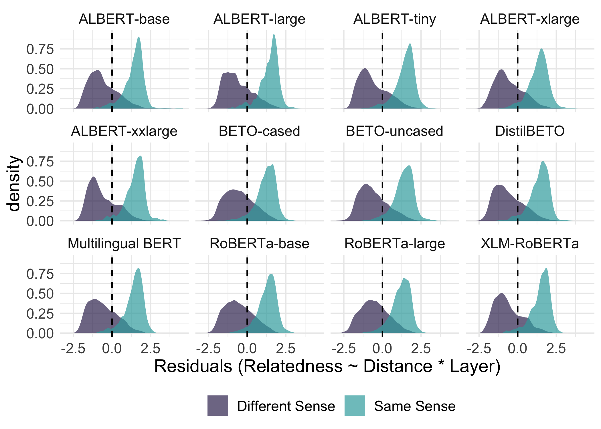<!-- -->
